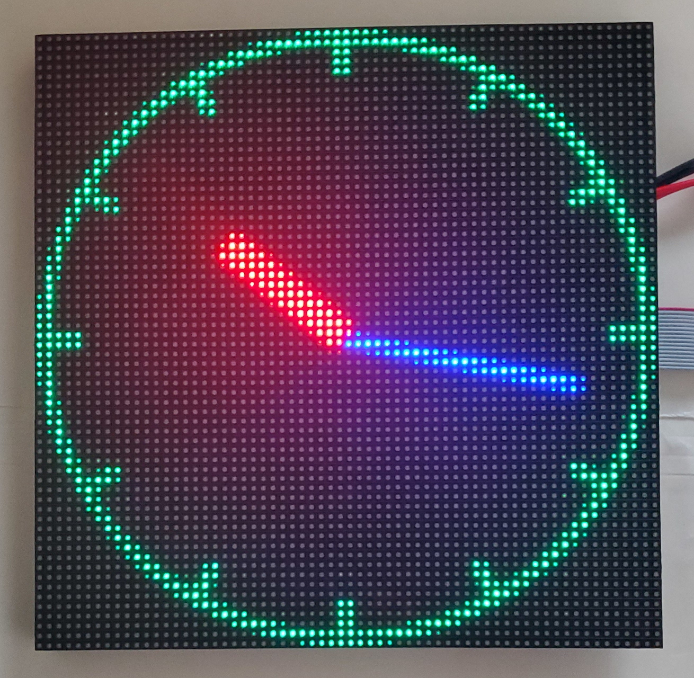

# led-matrix-clock
generates clockface and uploads it to an led matrix panel once a minute



# install
to install, run (from "sudo su" prompt):
```bash
 root@2020pi:~# mkdir -p build
 root@2020pi:~# cd build/
 root@2020pi:~/build# git clone https://github.com/mzandrew/led-matrix-clock.git
```

to run at every boot, edit /etc/rc.local
```bash
 root@2020pi:~# vim /etc/rc.local
```
add a line to that file like so (before the exit 0 line):
```vim
 nice /root/build/led-matrix-clock/clock.py &
```

reboot and enjoy!

# notes

This must be run as sudo, since it needs access to /dev/mem.  If you know another way to do it, please let me know!

The bonnet+panel uses 130 mA when dark and about 145 mA when illuminated with the shown clockface, so a modest power supply is all that's needed.

# thanks

Kudos to the scipython team for posting [code to generate clockfaces](https://scipython.com/blog/generating-an-svg-clock-face/) and to adafruit for posting a good [tutorial on how to wire up and use these panels with a rpi rgb matrix bonnet](https://learn.adafruit.com/adafruit-rgb-matrix-bonnet-for-raspberry-pi/driving-matrices
) and also to hzeller for the nice [library documentation](https://github.com/hzeller/rpi-rgb-led-matrix/tree/master/examples-api-use).
